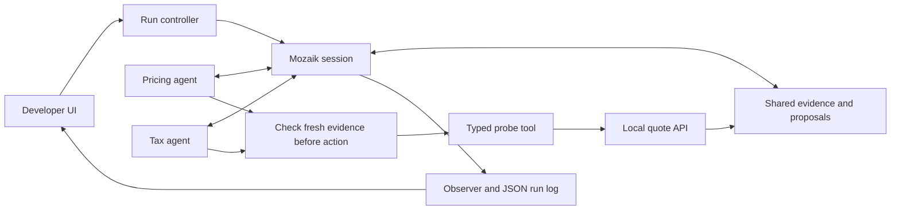

# SPECULATE — implementation architecture

Status September 6: Mozaik 4.0.5, local application and Vercel handlers implemented. Core evidence/export, HTTP routes and controlled installed-runtime behavior are tested. No real-provider result is claimed. See VERIFICATION.md for the latest executed checks.

## Shape

The same Node/TypeScript investigation code serves two environments. Locally, one process exposes a start endpoint and a separate event stream. On Vercel, POST /api/investigate owns the complete run inside one streamed response. Later requests never depend on a previous function's memory. Each checkout fixture binds an ephemeral loopback port and closes after its run. No database is needed.

The dependency-free browser surface is in web/; pnpm build copies it into dist/. Vercel bundles api/*.ts separately. GET /api/config reports setup readiness without exposing keys. POST /api/verify recomputes expected values and executes at most twelve captured inputs against the prebuilt corrected fixture. Browser exports contain the full completed artifact; local CLI runs can also save private artifacts to disk.

The canonical report and standalone regression generators live in web/export.js; the typed src/core/report.ts wrapper uses those same functions on the server and CLI. Build and both local servers serve the module explicitly, so hosted/imported exports cannot silently diverge from the tested implementation.

scripts/recorded-viewer.mjs uses only Node built-ins and a fixed list of built assets. It binds to loopback, imports no runtime, and rejects investigation requests. Its saved-run path remains labelled and has no corrected-fixture endpoint. Imported inputs are validated and reflected in the visible form.

Hosted config and investigation handlers load the runtime dynamically. Configuration can return a safe not-ready response even if runtime initialization fails; start validates the request and access code before loading the runtime. This preserves the recorded viewer during a dependency failure without claiming model readiness.

Hosted paid runs require a server-side model key and a private SPECULATE_RUN_TOKEN entered in the page. Each run permits at most twelve model requests and twelve probes within 120 seconds; Vercel allows 180 seconds for cleanup. This access code is a private-demo control, not a public multi-user quota system. Refreshing or losing the stream can lose the final hosted report; there is no durable recovery store. A request already in flight at the provider may finish after cancellation.

The diagram describes logical components, not independent deployed services.

## Runtime contract

Installed package pin: `@mozaik-ai/core@4.0.5`, recorded in pnpm-lock.yaml. Dependency installation succeeded; only esbuild's required build script is enabled. A provider-backed run is still pending.

Runtime imports use the package's shipped dist/index.mjs entry, with its matching shipped declarations. Its package.json has main/module fields but no conditional exports map: ordinary Node resolution selects CommonJS, whose cloud dependency fails under Vercel's require(ESM) restriction. The explicit ESM entry passes local checks with require(ESM) disabled. The final hosted verification is pending manual deployment; see VERIFICATION.md. Recheck this adapter if upgrading the package.

Use `defineRuntime`, `RuntimeState`, `createAgent`, and the returned loop/membership functions as supported by the actual installed declarations. Upstream source at `8f6b198cfae64026b157a17ed054a0d459abae76` uses `message_received`; some documentation describes older state names. The installed declarations and runtime checks take precedence over copied pseudocode.

Pricing and Tax are model-backed participants with different initial investigation priorities and equal access to the allowed observations. Their priorities name a stage and explicitly say not to assume it is faulty; they do not hint at a doubled operation. They share evidence through the Mozaik runtime. An observer is instrumentation, not a third model agent.

## Agent-facing tools

- `probe_quote(input)`: queries the owned loopback fixture and publishes immutable evidence. Input is bounded integer cents, quantity, discount basis points, and tax basis points.
- `read_evidence()`: returns the current evidence set and revision.
- `record_hypothesis(...)`: records an explanation, the evidence it cites, and whether the agent maintains, revises, or retracts it. This records model judgment; it is not an independent correctness oracle.
- `finish_investigation(...)`: records the proposed conclusion and supporting evidence. The final report must preserve unresolved questions.

Do not expose source files, the fixture mode flag, the verification output table, arbitrary shell commands, or arbitrary URLs to the runtime agents. Treat unexpected quote output as data. Probe response success/failure is determined by the fixture contract, not by model consensus.

## Replanning at the next action boundary

Capture the evidence revision used by each agent when preparing its current proposal. On a relevant `function_call` or next-inference transition, inspect whether new peer evidence has arrived. If so, present that evidence and the existing proposal for one bounded re-evaluation before execution. Preserve the resulting proposal even if it does not change.

Use the valid transition/input shapes from the installed package. A documented correction path may redirect to a properly constructed `message_received` state. Keep model context consistent: no orphan tool calls, invented successful tool results, or unbounded recursive replanning. Version checks, deduplication, and per-run limits prevent event loops.

An interceptor does not understand evidence by itself. Model reasoning chooses the new action; deterministic code checks tool validity, actual results, and bounded execution. Do not encode “evidence 3 kills Tax” as the mechanism.

The built-in inspected path does not abort an ongoing inference stream. Let it finish; revise the next action. `idle` is excluded from the interceptor's executable transition type. A correctly formed terminal message may close a branch at a boundary. Provider cancellation is outside MVP scope.

## Run/event contract for parallel implementation

The implemented envelope carries runId, monotonic sequence, elapsedMs, timestamp, type, optional agentId and a JSON data object. Applicable actionId, evidenceId and evidenceRevision live inside data. See src/contracts.ts. Domain events are separate from bounded native Mozaik lifecycle records with participant/loop identities; raw model payloads are excluded. Native overlap proves activity, not useful cooperation.

Initial domain types: `run.started`, `proposal.recorded`, `probe.started`, `probe.completed`, `hypothesis.revised`, `action.reconsidered`, `agent.completed`, `run.completed`, `run.failed`. `action.reconsidered` stores the previous and resulting proposal and referenced peer evidence. It must not automatically increment a “saved tests” counter.

A run artifact records schema version, app/package versions, model identifier, configuration, input fixture identity for the evaluator, ordered events, evidence, outcome, and usage where available. Missing usage is unavailable, not zero. Do not include credentials. Hide evaluator-only fields from prompts.

Avoid duplicate probe executions by a run-scoped input fingerprint that includes the fixture instance. If a prior result is reused, mark it reused and preserve provenance. Reuse and execution are counted separately. Atomic synchronous reservation before an awaited probe prevents duplicate ownership in one process.

## Evaluation and failure handling

One harness supports concurrent agents with replanning, concurrent agents without replanning, and an adaptive single-agent/sequential control with evidence reuse. Concurrency and coordination policy are explicit settings, not unrelated implementations.

Enforced limits: two agents (one for the single control), at most twelve executed probes and twelve model requests per run, one active loop per participant, bounded probe/model timeouts, and at most two reconsiderations per proposed action. Do not silently retry beyond the run budget. Runtime tests use controlled responses; provider-specific reliability still needs a real run.

If an agent fails, preserve completed evidence and show an incomplete run. If a provider is unavailable, offer an explicitly recorded artifact after a real successful run has been captured. Replaying a JSON event stream is enough for the MVP; do not build a general custom-inference replay engine.

Use `research/checkout-fixture/quote-service.mjs` as the single fixture implementation or deliberately move it with updated imports/docs. It already binds to loopback. A fresh installation may need network access; after setup, fixture and saved artifacts should work without it.
